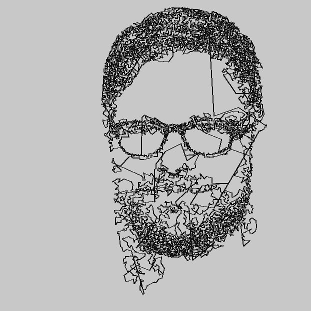
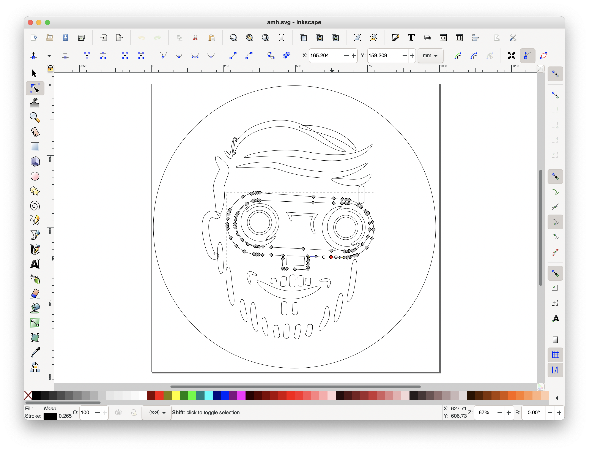
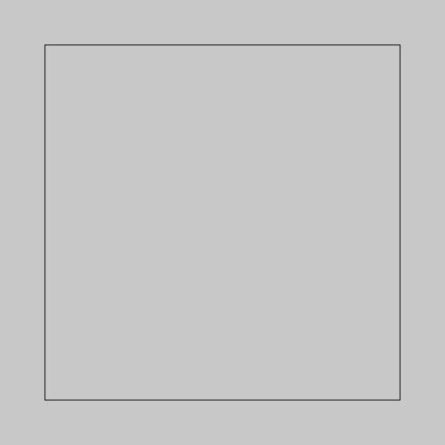
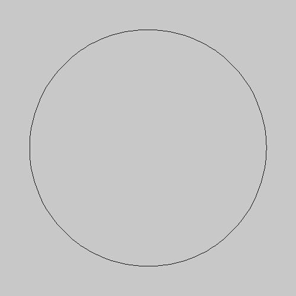
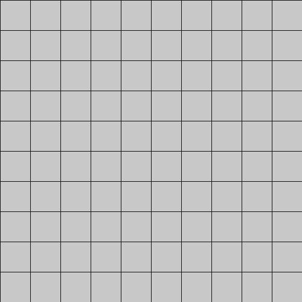

# L3onardo: generate coordinate lists for plotting #

This is a collection of python scripts that transform jpg and and svg files into into a list of coordinates. The output is normalized: coordinates range from 0 to 1, vertically and horizontally. The scripts write the result in csv file and in rtf (robot text files) files. You can upload rtf files to the classic MINDSTORMS EV3 graphic software interface. 

The csv file is for use with pybricks/python scripts that can also drive the vertical plotter.

You can build your own vertical plotter with some dental floss and a single kit of LEGO MINDSTORMS EV3, using the [Vertical Plotter Building Instructions](http://antonsmindstorms.com/product/31313-ev3-vertical-plotter-building-instructions/).

## Usage
I prefer to run my script inside `pipenv shell`. On MacOS, I installed pipenv with Homebrew. But you can also just plainly `pip3 install pillow`.

Open the any of the three generator scripts and edit the parameters, and input file names before running them.

Once you have created the coords.csv file, you can send them to the MINDSTORMS brick and plot them. The easiest way is with ev3dev. 
1. Burn a microsd card with the latest ev3dev.
2. Boot your MINDSTORMS brick with that card.
3. Instal Visual Studio Code
4. Install the LEGO MINDSTORMS Extension
5. Create a new VS Code window and up the subdirectory 'vertical_plotter_pybricks'
6. Connect to your MINDSTORMS EV3 brick
7. Press F5 (Run and debug)

## Different coordinate generators
The repository contains three generator scripts. They produce a csv file for use with a python plotter. The scripts also produce x.rtf and y.rtf files for use with the classic MINDSTORMS software.

The CSV file has normalized coordinates. That means the numbers are between 0.0 and 1.0. When the first coordinate is -1.0, the second coordinate tells the pen to lift (0) or write (1). The python plotting script can also handle 3 long-tuples. So `0.5, 0.5, 1` would tell the plotter to move to the middle of the paper with the pen down.

### Generate from image ##

#### Script
`python3 generate_from_img.py`

#### Source

#### Result

### Generate from SVG ##
Parses simple, single line svg files and creates a list of coordinates

#### Source in Inkscape

#### Result in point coordinates csv

### Generate geometry ##
Create the coordinate lists for squares and circles etc.

#### Sqaure

#### Circle

#### Grid
