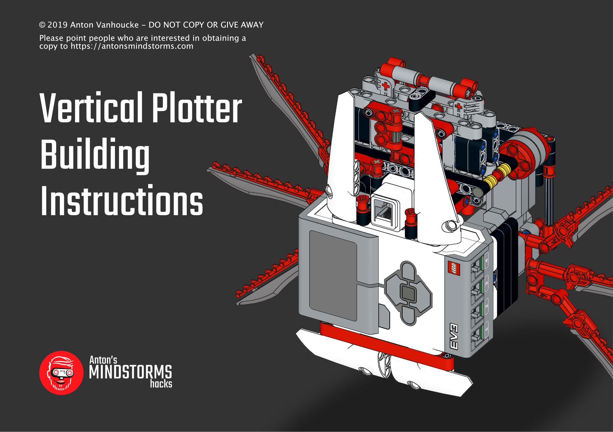

# L3onardo: generate coordinate lists for plotting #

This is a collection of python scripts that transform jpg and and svg files into into a list of coordinates. The output is normalized: coordinates range from 0 to 1, vertically and horizontally. The scripts write the result in csv file and in rtf (robot text files) files. You can upload rtf files to the classic MINDSTORMS EV3 graphic software interface. 

The csv file is for use with pybricks/python scripts that can also drive the vertical plotter.

You can build your own vertical plotter with some dental floss and a single kit of LEGO MINDSTORMS EV3, using the [Vertical Plotter Building Instructions](http://antonsmindstorms.com.transurl.nl/product/31313-ev3-vertical-plotter-building-instructions/).

## Usage
I prefer to run my script inside `pipenv shell`. On MacOS I installed pipenv with Homebrew. But you can also just plainly `pip3 install pillow`.

Open the script and edit the parameters, and input file names before running them.

## Generate from image ##
### Script
`python3 generate_from_img.py`

### Source

### Result

## Generate from SVG ##
Parses simple, single line svg files and creates a list of coordinates

## Generate geometry ##
Create the coordinate lists for squares and circles etc.
