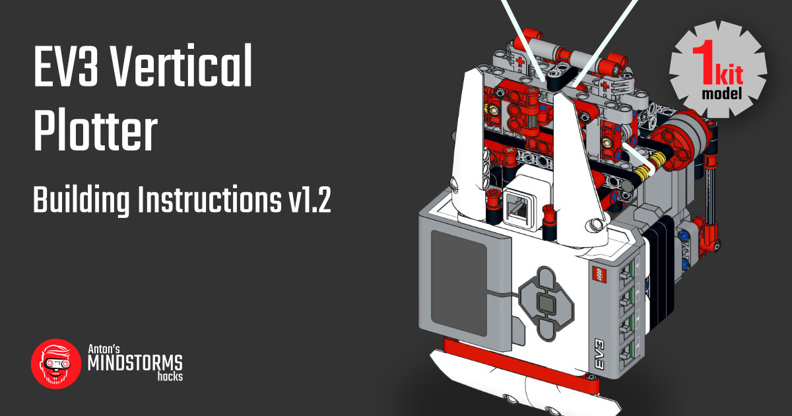
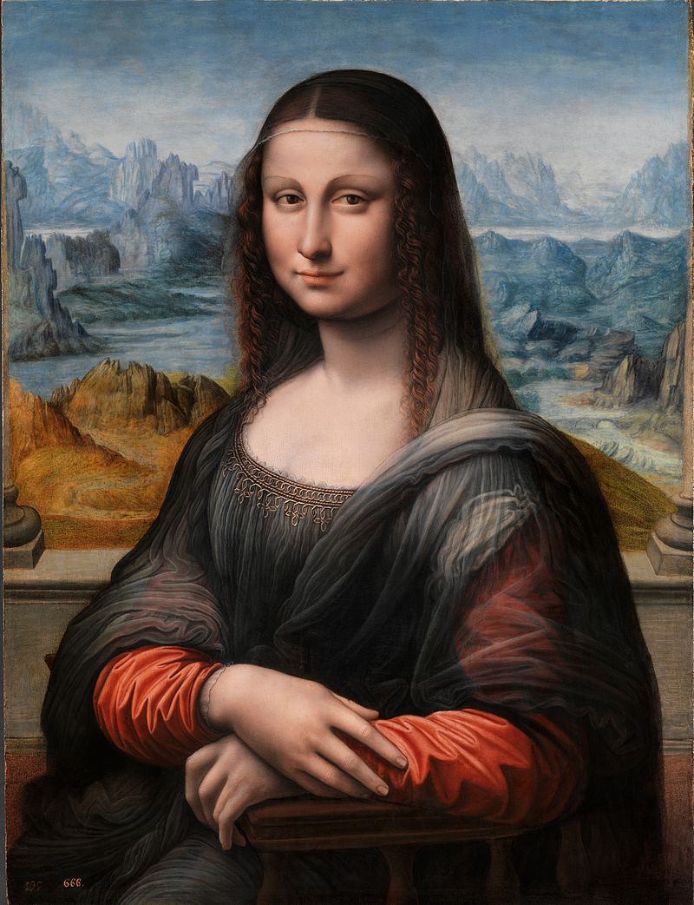

# L3onardo: generate coordinate lists for plotting #

This is a collection of python scripts that transform jpg and and svg files into into a list of coordinates. The output is normalized: coordinates range from 0 to 1, vertically and horizontally. The scripts write the result in csv file and in rtf (robot text files) files. You can upload rtf files to the classic MINDSTORMS EV3 graphic software interface. 

The csv file is for use with pybricks/python scripts that can also drive the vertical plotter.

You can build your own vertical plotter with some dental floss and a single kit of LEGO MINDSTORMS EV3, using the [Vertical Plotter Building Instructions](http://antonsmindstorms.com/product/31313-ev3-vertical-plotter-building-instructions/).

## Installation
### On Mac/PC
- Instal Visual Studio Code
- Install the LEGO MINDSTORMS Extension
- Git clone this repository by opening a new vs code window and selecting 'Clone Git Repository...'
- Install required python libs. I prefer to run my generator scripts inside `pipenv shell`. On MacOS, I installed pipenv with Homebrew. But you can also just plainly `pip3 install pillow`.

### On the EV3 brick
1. Burn a microsd card with the latest ev3dev.
2. Boot your MINDSTORMS brick with that card.

## Usage
Open the any of the four generate_* scripts and edit the parameters, and input file names before running them.

Once you have created the coords.csv file, you can send them to the MINDSTORMS brick and plot them. The easiest way is with ev3dev. 

1. Create a NEW VS Code window and open the subdirectory 'pybricks_plot_csv'.
2. Connect to your MINDSTORMS EV3 brick in the ev3dev device browser.
3. Press F5 (Run and debug).
4. The robot will beep when the script has booted.
5. With the direction keys you can run the motors.
6. Ensure the pen is just above the paper.
7. Ensure geomtry settings in the `main.py` script are correct.
6. Press center button to start plotting.

## Different coordinate generators
The repository contains three generator scripts. They produce a csv file for use with a python plotter. The scripts can also produce x.rtf and y.rtf files for use with the classic MINDSTORMS software.

I find it the easiest to run the scripts with the run button in the top right corner in Visual Studio Code.

The CSV file has normalized coordinates. That means the numbers are between 0.0 and 1.0. When the first coordinate is -1.0, the second coordinate tells the pen to lift (0) or write (1). The python plotting script can also handle 3 long-tuples. So `0.5, 0.5, 1` would tell the plotter to move to the middle of the paper with the pen down.

Examples:
`-1,0` lifts the pen
`0.5, 0.5` moves to the center of the canvas.
`0.5, 0.0, 1` moves to the top center of the canvas and then lowers the pen

### Generate from image ##
Find dark pixels and connect them with lines.

#### Source

#### Result

### Generate from SVG ##
Parses simple, single line svg files and creates a list of coordinates

#### Source in Inkscape

#### Result in point coordinates csv

### Generate geometry ##
Create the coordinate lists for squares and circles etc.

#### Sqaure

#### Circle

#### Grid

### Generate from linedraw.py ###
Script adapted from [linedraw.py](https://github.com/LingDong-/linedraw)

#### Source

#### Result
